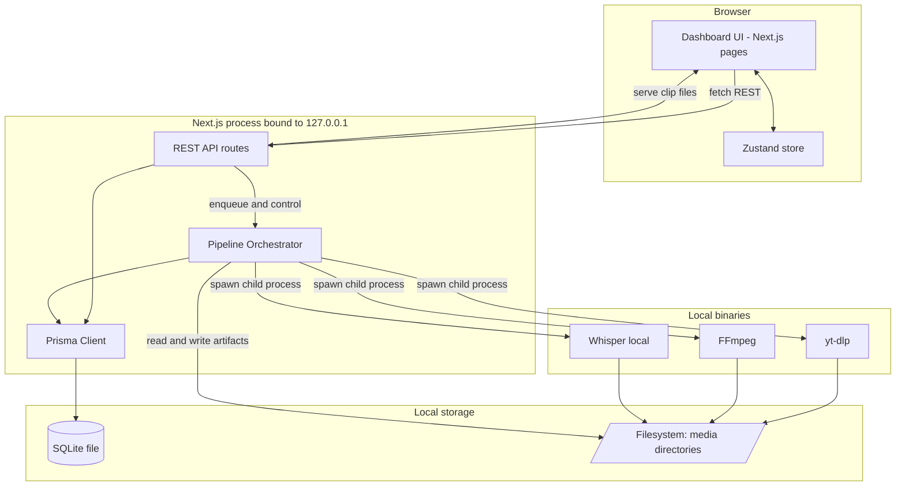
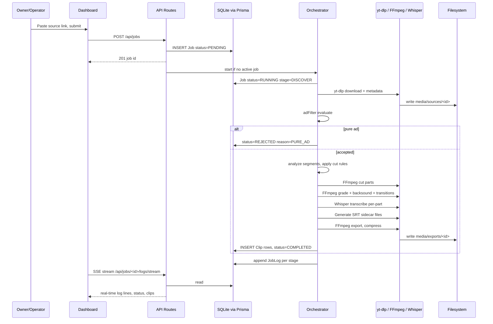
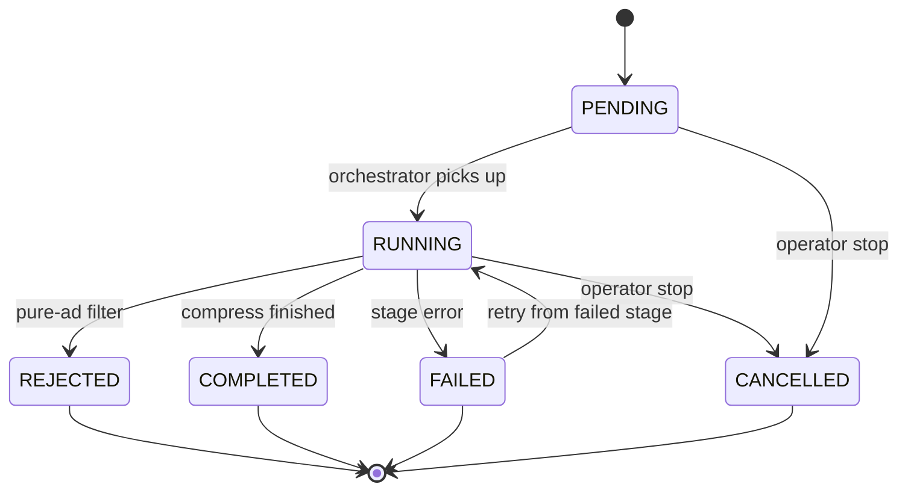
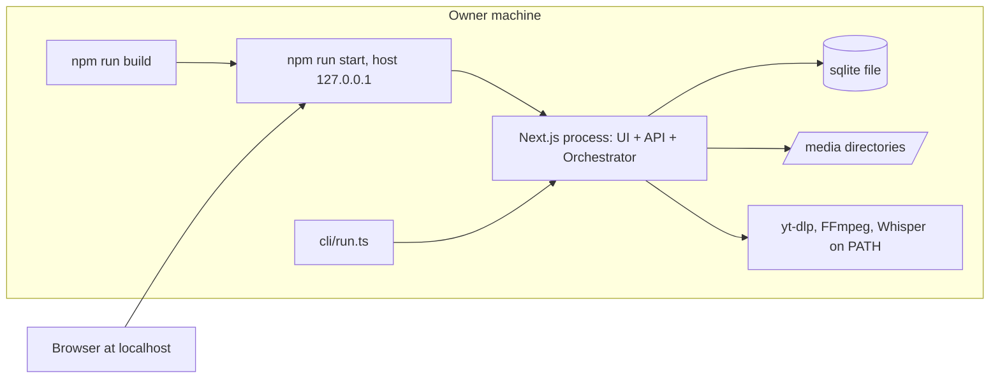

## Technology Stack

| Layer              | Technology               | Rationale                                                                                                                                                                                            |
| ------------------ | ------------------------ | ---------------------------------------------------------------------------------------------------------------------------------------------------------------------------------------------------- |
| UI framework       | **Next.js**              | Single process serves both the dashboard and the REST API routes. One `npm run build`, one runtime, no separate backend service to supervise on the owner's machine.                                 |
| Styling            | **Tailwind CSS**         | Utility classes keep dashboard markup self-describing; no design-system dependency for a single-operator tool.                                                                                       |
| Client state       | **Zustand**              | Job list, active job selection, and polled log buffers are ephemeral client state. Zustand gives a flat store without provider trees or reducer boilerplate.                                         |
| Delivery target    | **Responsive Web / PWA** | Dashboard is usable from a phone browser on the same machine's network stack only via localhost forwarding; responsive layout costs nothing with Tailwind. Installable shell with dark mode support. |
| Persistence        | **SQLite via Prisma**    | Single-file database, zero server process. Prisma supplies typed queries and migration history for `Job`, `JobLog`, `Clip`, and pipeline config rows.                                                |
| Media I/O          | **FFmpeg**               | Cutting, color grading presets, backsound mixing, transitions, subtitle rendering, export, and high-quality compression are all filter-graph and encoder work. Invoked as a child process.           |
| Source acquisition | **yt-dlp**               | Manual-link download and source metadata extraction. Invoked as a child process.                                                                                                                     |
| Transcription      | **Whisper (local)**      | Subtitle generation runs on-device, satisfying the no-third-party-transmission constraint.                                                                                                           |
| Testing            | **Vitest**               | Unit tests for pure logic — pure-ad filter, viral segment selection, part-cutting rules, output file naming — plus one end-to-end smoke test over a short sample video.                              |
| Pre-commit         | **husky + lint-staged**  | Enforces lint/format/test-on-changed before commit without CI infrastructure.                                                                                                                        |

**Binary versions (confirmed):**

- **Node.js:** 22.x LTS (latest stable, V8 performance improvements)
- **FFmpeg:** 7.0+ (latest stable)
- **yt-dlp:** Rolling latest (auto-update weekly; source platforms change frequently)
- **Whisper:** `base` model (5-7% WER, 1.5GB VRAM, optimal speed/accuracy balance for viral clips)

---

## High-Level System Architecture

Three logical components inside one Next.js process, plus external binaries and the local disk.

- **Web UI (client)** — React pages rendered by Next.js. Holds view state in Zustand, reads data exclusively over REST.
- **API layer (Next.js API routes)** — Request handlers for job creation, control, log reads, clip listing, and pipeline config. Owns all Prisma access; the client never touches the database.
- **Pipeline orchestrator (server-side module)** — In-process job runner. Executes pipeline stages in order, spawns yt-dlp / FFmpeg / Whisper as child processes, writes stage transitions and stdout/stderr lines to `JobLog`, writes artifact paths to `Clip`.
- **Local filesystem** — Source downloads, intermediate stage artifacts, final exports.
- **SQLite file** — Job metadata, logs, clip history, pipeline configuration.



**CLI entry point** — a thin script that imports the same orchestrator module and Prisma client. The pipeline is never duplicated between UI and CLI paths; both call one `runJob` surface.

**Concurrency posture** — strictly serial execution (one active job at a time). FFmpeg and Whisper saturate CPU/GPU on a single machine; parallel jobs would degrade both without throughput gain. Queued jobs wait in `PENDING` with FIFO ordering. Job runner module designed stateless for future parallel execution, but MVP spawns single instance only.

**PWA shell** — installable progressive web app with dark mode support. Assumes localhost connectivity (no offline capability required).

**Log transport** — Server-Sent Events (SSE) via `GET /api/jobs/:id/logs/stream`. Fallback to REST polling if SSE connection fails (2s interval when job RUNNING, 10s when idle).

---

## Directory & File Structure

```
.
├── AGENTS.md                     # Agent responsibilities: Pipeline, Web UI, QA
├── .env                          # Local secrets & paths, not committed
├── .env.example                  # Key names only, no values
├── prisma/
│   ├── schema.prisma             # Job, JobLog, Clip, PipelineConfig models
│   └── migrations/               # Migration history
├── src/
│   ├── app/                      # Next.js routes (UI + API)
│   │   ├── layout.tsx
│   │   ├── page.tsx              # Dashboard: job list + status
│   │   ├── jobs/[id]/page.tsx    # Job detail: stage timeline, log, clips
│   │   ├── settings/page.tsx     # Pipeline config editor
│   │   └── api/
│   │       ├── jobs/route.ts             # GET list, POST create
│   │       ├── jobs/[id]/route.ts        # GET detail, DELETE
│   │       ├── jobs/[id]/cancel/route.ts # POST stop
│   │       ├── jobs/[id]/retry/route.ts  # POST retry from failed stage
│   │       ├── jobs/[id]/logs/route.ts   # GET log page (polling fallback)
│   │       ├── jobs/[id]/logs/stream/route.ts # GET SSE stream
│   │       ├── clips/route.ts            # GET clip history
│   │       ├── clips/[id]/file/route.ts  # GET clip bytes / stream
│   │       └── config/route.ts           # GET, PUT pipeline config
│   ├── pipeline/                 # Pipeline Agent domain — no React imports
│   │   ├── orchestrator.ts       # Stage sequencing, cancellation, retry
│   │   ├── stages/
│   │   │   ├── discover.ts       # Manual link intake + source metadata
│   │   │   ├── adFilter.ts       # Pure-ad rejection rules (pure logic)
│   │   │   ├── analyze.ts        # Viral segment scoring (pure logic)
│   │   │   ├── cut.ts            # Multi-minute part rules (pure logic)
│   │   │   ├── edit.ts           # Grading preset, backsound, transitions
│   │   │   ├── subtitle.ts       # Whisper invoke + SRT generation
│   │   │   ├── export.ts         # Final render
│   │   │   └── compress.ts       # High-quality compression pass
│   │   ├── binaries/
│   │   │   ├── ytdlp.ts          # Argument construction + process wrapper
│   │   │   ├── ffmpeg.ts         # Filter-graph builders + process wrapper
│   │   │   └── whisper.ts        # Transcription process wrapper
│   │   └── naming.ts             # Deterministic output file naming
│   ├── server/
│   │   ├── db.ts                 # Prisma client singleton
│   │   ├── logger.ts             # Structured writes to JobLog + stdout
│   │   └── paths.ts              # Media directory resolution from env
│   ├── stores/
│   │   ├── jobStore.ts           # Zustand: job list, SSE, selection
│   │   └── uiStore.ts            # Zustand: panels, filters, log autoscroll
│   ├── components/               # Dashboard UI: StatusBadge, LogViewer, ClipCard
│   └── types/                    # Shared DTOs between API and client
├── cli/
│   └── run.ts                    # CLI entry into orchestrator
├── tests/
│   ├── unit/                     # Vitest: adFilter, analyze, cut, naming
│   ├── e2e/pipeline.smoke.test.ts# Full pipeline on short sample video
│   └── fixtures/sample.mp4       # Short sample input
└── media/                        # Runtime artifacts, gitignored
    ├── sources/                  # yt-dlp downloads
    ├── work/<jobId>/             # Intermediate stage artifacts
    ├── exports/<jobId>/          # Final clips
    └── assets/                   # Backsound files
```

### Directory intent

- `src/pipeline/` — the only place that touches external binaries. Stage modules split **pure decision logic** (`adFilter`, `analyze`, `cut`, `naming`) from **effectful media work** (`edit`, `subtitle`, `export`, `compress`) so the QA Agent can unit-test the former without media files.
- `src/app/api/` — thin handlers: validate input, call orchestrator or Prisma, return DTO. No pipeline logic.
- `src/server/` — server-only singletons. Never imported by client components.
- `media/` — filesystem is the artifact store; SQLite stores paths, not blobs. `work/<jobId>/` is disposable per job.
- `cli/` — alternate entry, same orchestrator.

---

## Data Flow

### Job creation → export



### Flow characteristics

- **Write path is server-only.** The browser never writes to SQLite or the filesystem; every mutation is a REST call.
- **Artifacts by reference.** Video bytes stay on disk; `Clip` rows carry path, duration, size, and source segment offsets. Playback is served through `GET /api/clips/:id/file`.
- **Log ingestion.** Child-process stdout/stderr is line-buffered by the binary wrappers and appended to `JobLog` with `jobId`, `stage`, `level`, `seq`. The dashboard polls by `seq` cursor, or subscribes to SSE stream for real-time updates.
- **Rejection is terminal.** A pure-ad rejection ends the job with a reason code; inline ads within an otherwise non-ad video do not trigger rejection.
- **Retention policy confirmed:**
  - `media/sources/` (downloaded videos): Deleted 7 days after job completion
  - `media/work/<jobId>/` (intermediate parts): Deleted immediately after job completion (stage COMPLETED/FAILED/REJECTED)
  - `media/exports/` (final clips): Retained indefinitely
  - Cleanup runs via daily scheduled task; partial cleanup on disk-full triggers

---

## State Management

State lives in four tiers with a single owner each.

| Tier                  | Contents                                                                              | Owner                      | Lifetime                                                                              |
| --------------------- | ------------------------------------------------------------------------------------- | -------------------------- | ------------------------------------------------------------------------------------- |
| Durable metadata      | `Job`, `JobLog`, `Clip`, `PipelineConfig`                                             | SQLite via Prisma          | Permanent until deleted; failed job logs purged 30 days after failure                 |
| Durable artifacts     | Source video, intermediates, exports                                                  | Local filesystem           | Sources: 7 days post-completion; work: immediate post-completion; exports: indefinite |
| Runtime process state | Active job handle, child process refs, cancellation flag                              | Orchestrator module memory | Process lifetime                                                                      |
| View state            | Fetched job list, selected job, log buffer (max 5000 lines), SSE stream subscriptions | Zustand                    | Tab lifetime                                                                          |

### Job state machine



Stage progress within `RUNNING` is a separate `stage` column: `DISCOVER`, `AD_FILTER`, `ANALYZE`, `CUT`, `EDIT`, `SUBTITLE`, `EXPORT`, `COMPRESS`.

### Zustand store rules

- `jobStore` is a **cache of server truth**, never an authority. Mutations optimistically flip status, then reconcile on the next poll response or SSE event.
- SSE connection per active job; falls back to polling on connection failure.
- Log buffer is capped at 5000 lines in memory; older lines are re-fetched from the API on scrollback.
- Crash recovery: on process start, the orchestrator marks any `RUNNING` row as `FAILED` with an `INTERRUPTED` reason, since no in-process handle survives a restart.

---

## API Design

REST over Next.js API routes. JSON request and response bodies. All routes are local-only; base URL `http://127.0.0.1:<port>/api`.

### Authentication strategy

**None.** Single-user local tool — no login, no sessions, no tokens. Authorization is replaced by network isolation: the server binds to the loopback interface, so it is unreachable from the LAN. There is one implicit principal, Owner/Operator, with full access to every route.

### Endpoints

| Method   | Path                        | Purpose                                                                                |
| -------- | --------------------------- | -------------------------------------------------------------------------------------- |
| `GET`    | `/api/jobs`                 | List jobs. Query: `status`, `limit`, `cursor`.                                         |
| `POST`   | `/api/jobs`                 | Create job from a manual link.                                                         |
| `GET`    | `/api/jobs/:id`             | Job detail with current stage and clip summary.                                        |
| `DELETE` | `/api/jobs/:id`             | Delete job row; artifact removal flag optional.                                        |
| `POST`   | `/api/jobs/:id/retry`       | Re-run a `FAILED` job from the failed stage; already-exported parts are reused.        |
| `POST`   | `/api/jobs/:id/cancel`      | Stop a `PENDING` or `RUNNING` job (graceful cancellation with SIGTERM → 5s → SIGKILL). |
| `GET`    | `/api/jobs/:id/logs`        | Log lines after a `seq` cursor (polling fallback).                                     |
| `GET`    | `/api/jobs/:id/logs/stream` | Server-Sent Events (SSE) stream of live log lines.                                     |
| `GET`    | `/api/clips`                | Clip history across jobs.                                                              |
| `GET`    | `/api/clips/:id/file`       | Stream clip bytes with range support.                                                  |
| `GET`    | `/api/config`               | Current pipeline configuration.                                                        |
| `PUT`    | `/api/config`               | Update pipeline configuration.                                                         |

### Request / response shapes

```json
// POST /api/jobs
// Only sourceUrl is accepted. Pipeline parameters live in global config
// (GET|PUT /api/config). Per-job override is out of MVP scope by decision:
// the operator reviews output at the end instead of tuning per job.
{
  "sourceUrl": "https://example.com/watch?v=abc123"
}
```

```json
// 201 Created
{
  "id": "job_01H...",
  "status": "PENDING",
  "stage": null,
  "sourceUrl": "https://example.com/watch?v=abc123",
  "createdAt": "..."
}
```

```json
// GET /api/jobs/:id
{
  "id": "job_01H...",
  "status": "RUNNING",
  "stage": "SUBTITLE",
  "progress": { "current": 6, "total": 8 },
  "rejectionReason": null,
  "analysisConfidence": "HIGH",
  "fallbackApplied": false,
  "source": { "title": "...", "durationSeconds": 4210 },
  "clips": [
    {
      "id": "clip_01H...",
      "index": 1,
      "durationSeconds": 178,
      "fileName": "abc123_part01_1080p.mp4",
      "sizeBytes": 41235123,
      "subtitlePath": "abc123_part01.srt",
      "gradingPreset": "cinematic-teal-orange",
      "backsoundMood": "energetic"
    }
  ]
}
```

```json
// GET /api/jobs/:id/logs?after=412&limit=200
{
  "lines": [
    {
      "seq": 413,
      "stage": "SUBTITLE",
      "level": "info",
      "message": "whisper: transcribing part 1",
      "at": "..."
    }
  ],
  "nextCursor": 613,
  "hasMore": true
}
```

### Error format

```json
{
  "error": {
    "code": "PURE_AD_REJECTED",
    "message": "Source classified as pure advertisement.",
    "details": { "signals": ["title-match", "duration-under-threshold"] }
  }
}
```

Codes: `VALIDATION_FAILED`, `JOB_NOT_FOUND`, `JOB_ALREADY_RUNNING`, `PURE_AD_REJECTED`, `NO_QUALIFYING_SEGMENTS`, `BINARY_NOT_FOUND`, `STAGE_FAILED`, `INTERNAL`.

### Conventions

- Input validation is hand-written in each route handler; no validation library is in scope.
- Log and job lists are cursor-paginated to keep dashboard responses bounded on long jobs.
- Log transport: Server-Sent Events (SSE) via `GET /api/jobs/:id/logs/stream` for real-time log updates. Falls back to REST polling (2s interval when job RUNNING, 10s when idle) if SSE connection fails.
- Log buffer size capped at 5000 lines per job in memory; older lines re-fetched from SQLite on scrollback.

---

## Security Architecture

Threat surface is small by construction: one machine, one user, no network exposure, no outbound data.

### Network layer

- Web server binds to `127.0.0.1` only. Not reachable from other hosts on the LAN, so no unauthenticated service is exposed to the network.
- No reverse proxy, no TLS termination, no public port. If the operator ever needs remote access, that is a scope change requiring explicit auth design — **not part of MVP**.

### Application layer

- No auth system, deliberately. Single principal, and the loopback bind is the access control boundary. This is documented so it cannot be mistaken for an oversight.
- API routes accept only expected fields; unknown keys in request bodies are ignored rather than passed to pipeline config.
- Path handling: every filesystem read/write resolves through `src/server/paths.ts` against configured media roots. Job-derived names never concatenate raw user input into paths — `naming.ts` produces sanitized, deterministic file names, blocking traversal via crafted source titles.
- Clip file serving resolves the path from the `Clip` row by id, never from a client-supplied path parameter.

### Process execution layer

- yt-dlp, FFmpeg, and Whisper are spawned with **argument arrays, never shell strings**. No user-supplied value reaches a shell, eliminating command injection through source URLs or titles.
- Source URLs are validated for scheme and shape before being handed to yt-dlp.
- Child processes are tracked by the orchestrator so cancellation terminates them rather than orphaning encoders.
- Cancellation strategy: graceful shutdown with SIGTERM → 5s wait → SIGKILL if still alive.

### Data layer

- Prisma parameterizes all queries; no raw SQL string building.
- SQLite file and `media/` live under the project or an operator-configured path, protected by OS file permissions.

### Secrets & data handling

- Sensitive configuration lives in a local `.env`, gitignored. `.env.example` carries key names only, never values.
- No telemetry, no analytics, no crash reporting, no third-party API calls. Source video, clips, transcripts, and logs remain on the owner's machine.
- Log redaction: JobLog captures binary stdout/stderr; wrappers strip any env-derived values before persisting so `.env` contents cannot leak into the dashboard.

### Compliance posture

Downloaded content is used for personal purposes under the source platform's ToS. No other person's data is stored, so no external privacy obligation applies. Retention is confirmed: sources 7 days, work directories deleted on job completion, exports kept indefinitely, failed-job logs purged after 30 days.

---

## Deployment Architecture

### Model

Local single-machine deployment. No container orchestration, no cloud, no CI/CD pipeline in MVP scope.



### Install and run

1. Install Node dependencies.
2. Provide `.env` from `.env.example` — media roots, port, binary paths.
3. Run `prisma migrate deploy` to create or upgrade the SQLite schema.
4. Verify yt-dlp, FFmpeg, and Whisper resolve on `PATH`; the orchestrator performs a startup preflight and fails fast with `BINARY_NOT_FOUND` rather than mid-job.
5. `npm run build`, then `npm run start` with the host flag pinned to `127.0.0.1`.
6. Open the dashboard in a browser; install as PWA if desired.

### Process supervision

Foreground process by default. Long-running use — via `systemd --user`, `launchd`, or a terminal multiplexer — is an operator choice, not a product dependency. Restart behavior is defined: interrupted `RUNNING` jobs are reconciled to `FAILED / INTERRUPTED` on next boot.

### Scaling

Scaling is **vertical and out of scope as a feature**. Throughput is bound by CPU/GPU for FFmpeg and Whisper on one machine. Job concurrency is fixed at one; the queue is FIFO over `PENDING` rows. Horizontal scaling would require multi-user architecture, which is an explicit non-goal.

### Quality gates

- `husky` + `lint-staged` run lint and affected Vitest units pre-commit.
- Vitest units cover the pure-ad filter, viral segment selection, part-cutting rules, and output naming.
- One end-to-end smoke test runs the full pipeline on `tests/fixtures/sample.mp4` through export. Treated as the release gate before the operator runs real jobs.
- UI verification is manual, per QA scope.

### Backup

_Rekomendasi (bukan komitmen MVP):_ copy the SQLite file and `media/exports/` — those two paths hold all durable state; `media/work/` is disposable. Automated backup is **out of MVP scope**.

### Out of scope

- Auto-discovery via followed channels and viral trending feeds — post-MVP phase.
- Sound effects, visual elements, advanced video effects — post-MVP phase.
- Hosted deployment, multi-user or account system, containerization, remote access.
- H.265/HEVC output, LUT-based grading, custom operator presets, subtitle burn-in, multi-language transcription, parallel job execution, per-job config override.

### Remaining escalations

The engagement-vector and network-graph signals listed in the analyzer design (retention rate, completion rate, loop coefficient, share ratio, first-hour velocity, cross-cluster penetration, creator authority) require post-publication platform telemetry that a local-only tool cannot observe. They stay **out of MVP scope**; the analyzer computes intrinsic signals only. Confirm if a manual feedback loop (operator scores published clips, scores feed back into weights) should be added as a later phase.

---

## Pipeline Configuration Details

All confirmed pipeline parameters, stored in `PipelineConfig` table, editable via `/api/config`.

### Part Duration & Cutting Rules

```typescript
{
  partDuration: {
    minSeconds: 120,    // 2 minutes absolute minimum
    maxSeconds: 300,    // 5 minutes absolute maximum
    targetSeconds: 180, // 3 minutes target
    mergeThreshold: 120 // remainder < 2min merges with previous part
  }
}
```

**Boundary handling:** Segments shorter than `minSeconds` are discarded. Remainder below `mergeThreshold` attaches to previous part. No per-job override — operator reviews output post-run instead of manual tuning.

### Pure-Ad Filter Signals

Multi-signal detection with fail-safe toward acceptance:

1. **Metadata & Title** — keyword patterns (`"sponsored"`, `"#ad"`, `"promo"`, brand names in title)
2. **Temporal** — duration < 30s (typical ad spot), lack of story-hook progression
3. **Visual** — scene uniformity (studio lighting consistency), static overlays/watermarks via template matching
4. **Audio & Transcript** — isolated voice-over with product-dense lexical density (CTA keywords per minute)

**Decision logic:** Weighted scoring across signals. Reject only on high-confidence combination (e.g., title-match + duration + CTA-density > threshold). Videos with embedded ads (`iklan sisipan`) pass through — filter targets whole-video ads only.

**Implementation:** Pure function in `adFilter.ts`, unit-testable with fixture videos.

### Viral Segment Scoring (Intrinsic-Only MVP)

```typescript
// Platform-telemetry signals (retention, shares, completion) are out of scope
// Analyzer computes intrinsic features only:
interface SegmentScore {
  shotChangeRate: number; // Scene cuts per minute (pacing)
  visualSaliency: number; // Face tracking + motion energy
  colorDynamicRange: number; // Saturation + contrast variance
  audioRMSLoudness: number; // Dynamic loudness spikes
  hookEmbedding: number; // NLP-based hook strength from transcript
  bpmAlignment: number; // BPM vs. shot-change sync (music detection)
}

// Scoring weights (tunable in PipelineConfig):
const weights = {
  shotChangeRate: 0.25,
  visualSaliency: 0.2,
  colorDynamicRange: 0.15,
  audioRMSLoudness: 0.15,
  hookEmbedding: 0.15,
  bpmAlignment: 0.1,
};

// Adaptive thresholding:
// numSegments = Clamp(
//   count(segments where score >= threshold),
//   min = 1,
//   max = ceil(durationMinutes / 3)
// )
```

**Fallback behavior:** If no segment meets threshold, return top-1 by score with `fallbackApplied: true` flag. Zero-segment response only for pure-ad rejection.

**Confidence scoring:** `HIGH` if top segment score > 0.75, `MEDIUM` if > 0.6, `LOW` otherwise. Logged in job metadata.

### Audio Mixing & Backsound

```typescript
{
  audioLevels: {
    sourceGain: -3,      // Source audio dB (preserves dynamics)
    backsoundGain: -18,  // Baseline backsound dB
    duckingGain: -24,    // Backsound when voice detected
    peakLimit: -1        // Ceiling in dBFS (prevent clipping)
  },
  fadeDuration: 2.0,     // Fade-in/out seconds at part boundaries
  duckTransition: 0.5,   // Voice-detection ducking transition seconds

  // Auto-select backsound from media/assets/ based on segment mood
  moodMapping: {
    'energetic': 'energetic.mp3',   // High RMS + fast cuts
    'calm': 'calm.mp3',             // Low RMS + slow pacing
    'dramatic': 'dramatic.mp3',     // High dynamic range
    'neutral': 'neutral.mp3'        // Fallback
  },

  // Mood detection thresholds:
  moodThresholds: {
    energeticRMS: -15,      // dB threshold
    energeticCutRate: 8,    // cuts per minute
    calmRMS: -25,
    calmCutRate: 3
  }
}
```

**Voice detection:** FFmpeg `silencedetect` filter identifies speech regions. Backsound ducks from -18dB to -24dB during dialogue, with 0.5s crossfade transitions.

**Fade behavior:** Always fade in/out (2s duration). Instant cuts sound amateurish for viral content.

**Backsound format:** Accepts MP3, WAV, OGG. Operator pre-loads 4-5 tracks into `media/assets/`. Auto-selection based on segment's `audioRMSLoudness` and `shotChangeRate` scores.

### Subtitle Configuration

```typescript
{
  subtitleFormat: 'SRT',    // Sidecar .srt file (editable post-export)
  language: 'source',       // Whisper auto-detects source language
  autoSubtitle: true,       // Enabled by default
  maxLineLength: 42,        // Characters per line
  maxLines: 2,              // Lines per subtitle cue
  minDuration: 1.0,         // Minimum cue duration (seconds)
  maxDuration: 7.0          // Maximum cue duration (seconds)
}
```

**No burn-in (hardcoded subtitles):** Subtitles remain as separate `.srt` files for post-edit flexibility. Operator can manually adjust timing/wording before final distribution.

**Whisper execution:** Per-part transcription (not batch). Each cut part transcribed independently for better error isolation and future parallel execution.

**Error handling:** Retry once after 10s delay. If second attempt fails, mark stage FAILED immediately (Whisper crashes are usually persistent: model corruption, OOM).

**Output format:** SRT chosen for simplicity and universal support. VTT and JSON deferred to post-MVP.

### Export & Compression

```typescript
{
  export: {
    container: 'mp4',
    videoCodec: 'libx264',
    preset: 'medium',         // Speed vs. compression trade-off
    crf: 21,                  // Visually excellent, imperceptible loss
    maxWidth: 1920,           // Downscale 4K→1080p, keep native if ≤1080p
    maxHeight: 1080,
    scalingAlgorithm: 'lanczos',

    // FFmpeg filter chain for export
    filterComplex: [
      'scale=min(1920\\,iw):min(1080\\,ih):force_original_aspect_ratio=decrease',
      'pad=1920:1080:(ow-iw)/2:(oh-ih)/2'  // center + letterbox if needed
    ]
  },
  audio: {
    codec: 'aac',
    bitrate: '192k',
    channels: 2,
    sampleRate: 48000
  },
  optimization: {
    faststart: true,          // Enable streaming (moov atom first)
    keyframeInterval: 48      // GOP size (every 2s at 24fps)
  }
}
```

**Codec trade-off (H.264 vs H.265):**

| Codec            | Pro                                                          | Con                                                           | MVP choice      |
| ---------------- | ------------------------------------------------------------ | ------------------------------------------------------------- | --------------- |
| **H.264 (AVC)**  | Universal playback, hardware decode all devices, fast encode | File size 30-50% larger                                       | ✅ **Selected** |
| **H.265 (HEVC)** | 40-50% smaller, better quality at low bitrate                | Licensing issues, slower encode, inconsistent browser support | Post-MVP        |

**Quality setting (CRF values):**

| CRF    | Visual                        | File Size               | Use Case               |
| ------ | ----------------------------- | ----------------------- | ---------------------- |
| 18     | Visually lossless             | Very large              | Archival only          |
| **21** | Excellent, imperceptible loss | Optimal                 | ✅ **Selected**        |
| 23     | Very good                     | 20% smaller than CRF 21 | Budget-constrained     |
| 26+    | Visible artifacts             | Small                   | Unacceptable for viral |

**Resolution strategy:** Native source resolution, capped at 1080p.

- No upscaling (720p source → stays 720p)
- Downscale if source > 1080p (4K → 1080p for faster encoding)
- Reasoning: Viral shorts don't require 4K, 1080p sufficient for mobile viewing

**Preset explanation** (`-preset medium`):

- `ultrafast`: 10x faster, +50% file size (identical visual quality)
- `fast`: 3x faster, +15% file size
- **`medium`**: Baseline (selected for MVP)
- `slow`: 2x slower, -5% file size (diminishing returns)
- `veryslow`: 5x slower, -10% file size (not practical for localhost)

**FFmpeg command essence:**

```bash
ffmpeg -i input.mp4 \
  -c:v libx264 -preset medium -crf 21 \
  -vf "scale='min(1920,iw)':'min(1080,ih)':force_original_aspect_ratio=decrease,pad=1920:1080:(ow-iw)/2:(oh-ih)/2" \
  -c:a aac -b:a 192k -ar 48000 \
  -movflags +faststart \
  output.mp4
```

### Color Grading Presets (Fixed List)

Five FFmpeg filter-chain presets — no LUT files, no custom operator presets in MVP:

```typescript
type GradingPreset =
  'natural' | 'warm-vibrant' | 'cinematic-teal-orange' | 'high-contrast-bw' | 'cool-desaturated';

const presets: Record<GradingPreset, string> = {
  // Minimal adjustment, baseline reference
  natural: '',

  // Warm lift in shadows, boost saturation for energy
  'warm-vibrant':
    'eq=brightness=0.05:saturation=1.3,' +
    'curves=r="0/0 0.5/0.58 1/1":g="0/0 0.5/0.5 1/1":b="0/0 0.5/0.42 1/1"',

  // Industry-standard teal highlights, orange shadows (DP favorite)
  'cinematic-teal-orange':
    'colorbalance=rs=-0.1:gs=0.0:bs=0.1:rh=0.1:gh=0.0:bh=-0.1,' + 'eq=saturation=1.2',

  // Monochrome dramatic look (desaturate, boost contrast)
  'high-contrast-bw': 'eq=saturation=0,' + 'curves=r="0/0 0.5/0.4 1/1"',

  // Moody low-saturation (indie film aesthetic)
  'cool-desaturated':
    'eq=saturation=0.6,' + 'colorbalance=rs=0.0:gs=-0.05:bs=0.1,' + 'curves=r="0/0 0.5/0.45 1/1"',
};
```

**Implementation trade-off:**

| Method                   | Pro                                         | Con                                         | MVP choice      |
| ------------------------ | ------------------------------------------- | ------------------------------------------- | --------------- |
| **FFmpeg filter chains** | No external files, easy iteration, portable | Verbose command strings                     | ✅ **Selected** |
| **LUT files (.cube)**    | Industry-standard, portable                 | External file management, harder to iterate | Post-MVP        |
| **Lookup table (code)**  | Fastest                                     | Hardcoded, inflexible                       | Not suitable    |

**Application:** Presets applied as part of export filter chain before scaling/padding.

### Whisper Transcription

```typescript
{
  model: 'base',           // base model (5-7% WER, 1.5GB VRAM)
  language: 'auto',        // Auto-detect from audio
  task: 'transcribe',
  temperature: 0.0,        // Deterministic output (no sampling)
  beamSize: 5,
  outputFormat: 'srt',     // Direct SRT output
  maxCharsPerLine: 42,
  timeout: 600             // 10-minute timeout per part
}
```

**Execution strategy:** Per-part transcription (not batch).

- Each cut part transcribed independently
- Better error isolation (one part failure doesn't kill all)
- Enables future parallel execution
- Simpler retry logic

**Error handling:**

1. Whisper transcription fails
2. Retry once after 10s delay
3. If second attempt fails, stage marked FAILED immediately
4. Already-transcribed parts persist; operator can export subset

**Why retry is minimal:** Whisper crashes are usually persistent (model OOM, corrupted weights), so retrying more than once wastes time.

### Error Recovery & Retry

```typescript
// Partial-artifact persistence:
- Completed parts remain exportable even if later parts fail
- Subset export allowed (parts 1-3 OK, part 4 failed → export 1-3)
- Job retry from failed stage (POST /api/jobs/:id/retry)
  * Skips already-completed stages
  * Reuses intermediate artifacts
  * Regenerates logs for retry attempt

// Log retention:
- Failed-job logs purged after 30 days
- Completed-job logs kept indefinitely
```

**Retry semantics:** A `FAILED` job can be retried via `POST /api/jobs/:id/retry`. Retry resumes from the failed stage, reusing outputs from earlier stages. If a later stage fails in the retry, it overwrites previous artifacts for that stage only.

**Partial export:** If stage EXPORT fails after parts 1-3 complete, operator can export clips 1-3 from dashboard while fixing the issue that broke part 4.

### Log & Monitoring

```typescript
{
  polling: {
    runningInterval: 2000,   // 2s when job RUNNING (fallback)
    idleInterval: 10000,     // 10s when job idle
    sseEnabled: true,        // SSE stream via /api/jobs/:id/logs/stream
    sseReconnectBackoff: 1000 // 1s initial, exponential to max 30s
  },
  buffer: {
    maxLines: 5000,          // In-memory buffer per job
    sqliteRetention: 'all'   // All lines persisted to SQLite
  },
  redaction: {
    stripEnvVars: true,      // Remove .env values from logs
    stripPaths: false        // Keep absolute paths for debugging
  }
}
```

**Log transport priority:**

1. SSE stream (real-time, preferred)
2. REST polling fallback (2s interval while running)
3. Full re-fetch on page reload (from SQLite)

**Buffer management:** Zustand keeps last 5000 lines in memory. Scrollback beyond that re-fetches from SQLite by `seq` cursor.

### File Cleanup Schedule

Daily scheduled task (Node.js via node-schedule, runs at 03:00 UTC):

```typescript
// media/sources/     → delete files older than 7 days after job completion
// media/work/<jobId> → delete immediately after job reaches terminal state
// media/exports/     → keep forever (manual cleanup only)
// Failed-job logs   → purge rows older than 30 days from JobLog

// Triggered cleanup on disk-full:
// If available space < 5GB, force cleanup without waiting for scheduled time
// Priority: work/ > sources/ > failed logs (exports always spared)
```

All parameters are stored in the `PipelineConfig` table, editable via the settings page. No per-job overrides — global config only.

---

## Configuration Management

### PipelineConfig Schema

```typescript
// Prisma schema excerpt
model PipelineConfig {
  id              String    @id @default(cuid())

  // Part duration settings
  partDurationMinSeconds    Int     @default(120)
  partDurationMaxSeconds    Int     @default(300)
  partDurationTargetSeconds Int     @default(180)
  partDurationMergeThreshold Int    @default(120)

  // Audio settings
  audioSourceGain           Float   @default(-3)
  audioBacksoundGain        Float   @default(-18)
  audioBacksoundDucking     Float   @default(-24)
  audioFadeDuration         Float   @default(2.0)

  // Export settings
  exportCRF                 Int     @default(21)
  exportPreset              String  @default("medium")
  exportMaxWidth            Int     @default(1920)
  exportMaxHeight           Int     @default(1080)

  // Subtitle settings
  subtitleAutoEnabled       Boolean @default(true)
  subtitleLanguage          String  @default("source")
  subtitleMaxLineLength     Int     @default(42)

  // Grading preset (fixed list)
  gradingPreset             GradingPreset @default("natural")

  // Backsound mood auto-select
  backsoundAutoMood         Boolean @default(true)

  // Analysis settings
  viralScoreThreshold       Float   @default(0.6)
  analysisConfidenceMin     String  @default("MEDIUM")

  createdAt                 DateTime @default(now())
  updatedAt                 DateTime @updatedAt
}

enum GradingPreset {
  NATURAL
  WARM_VIBRANT
  CINEMATIC_TEAL_ORANGE
  HIGH_CONTRAST_BW
  COOL_DESATURATED
}
```

**Settings page flow:**

1. `GET /api/config` → fetch current PipelineConfig
2. Operator edits values in dashboard form
3. `PUT /api/config` → update row (validates ranges)
4. New jobs use updated config immediately
5. Running jobs continue with snapshot taken at start

---

## Conclusion: MVP Scope Finalized

**All TBD items resolved. MVP is now ready for implementation.**

| Category       | Decision                                                 |
| -------------- | -------------------------------------------------------- |
| Pure-ad filter | Multi-signal with fail-safe to accept                    |
| Viral scoring  | Intrinsic features only, adaptive thresholding           |
| Part duration  | 2-5 min, merge remainder < 2min                          |
| Audio mixing   | -3dB source, -18dB backsound, -24dB when ducked, 2s fade |
| Subtitles      | SRT sidecar, source language, per-part Whisper           |
| Export codec   | H.264, CRF 21, preset medium, 1080p max                  |
| Log transport  | SSE + polling fallback, 5000-line buffer                 |
| File retention | Sources 7d, work immediate, exports forever              |
| Binaries       | Node 22.x, FFmpeg 7.0+, yt-dlp rolling, Whisper base     |
| Concurrency    | Serial MVP, FIFO queue, graceful cancellation            |
| PWA            | MVP with dark mode, localhost only                       |
| Error recovery | Retry from failed stage, partial export allowed          |
| Backsound      | Auto-select by mood, 4-5 tracks in media/assets/         |
| Color grading  | 5 FFmpeg filter presets, no custom in MVP                |

**Next phase:** Implement Prisma schema, then begin agent-driven development (Pipeline Agent → Web UI Agent → QA Agent).
