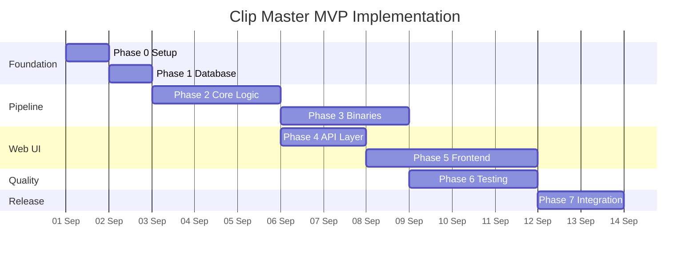

# Clip Master - Detailed Implementation Plan

**MVP Scope:** 100% Free Stack (Opsi A)  
**Start Date:** 2026-09-01  
**Target Completion:** 2026-10-03 (32 days)  
**Current Phase:** Foundation Setup

---

## Progress Dashboard

### Overall Progress: 0% Complete (0/157 tasks)

| Phase                                       | Tasks | Completed | Progress | Status         |
| ------------------------------------------- | ----- | --------- | -------- | -------------- |
| **Phase 0:** Pre-Development                | 8     | 0         | 0%       | 🔴 Not Started |
| **Phase 1:** Foundation Setup               | 15    | 0         | 0%       | 🔴 Not Started |
| **Phase 2:** Pipeline Agent Core            | 42    | 0         | 0%       | 🔴 Not Started |
| **Phase 3:** Pipeline Agent Binary Wrappers | 18    | 0         | 0%       | 🔴 Not Started |
| **Phase 4:** Web UI Agent - API Layer       | 22    | 0         | 0%       | 🔴 Not Started |
| **Phase 5:** Web UI Agent - Frontend        | 28    | 0         | 0%       | 🔴 Not Started |
| **Phase 6:** QA Agent - Testing             | 16    | 0         | 0%       | 🔴 Not Started |
| **Phase 7:** Integration & Polish           | 8     | 0         | 0%       | 🔴 Not Started |

### Milestone Tracker

- [ ] **M0:** Development environment ready (Day 1)
- [ ] **M1:** Database schema deployed (Day 2)
- [ ] **M2:** Pure-ad filter working (Day 5)
- [ ] **M3:** Segment analyzer working (Day 8)
- [ ] **M4:** First clip exported (Day 12)
- [ ] **M5:** Dashboard shows job list (Day 18)
- [ ] **M6:** Full pipeline end-to-end (Day 25)
- [ ] **M7:** MVP release ready (Day 32)

---

## Phase 0: Pre-Development Setup

**Owner:** Setup / Infrastructure  
**Duration:** 1 day  
**Dependency:** None

### ENV-001: Project Directory Setup

- [ ] Create project root directory
- [ ] Initialize git repository (`git init`)
- [ ] Create `.gitignore` (node_modules, .env, media/, dist/)
- [ ] Copy AGENTS.md, ARCHITECTURE.md, PRD.md to root
- **Estimate:** 15 min

### ENV-002: Node.js Environment

- [ ] Verify Node.js 22.x LTS installed (`node --version`)
- [ ] Update npm to latest (`npm install -g npm@latest`)
- [ ] Initialize package.json (`npm init -y`)
- [ ] Set "type": "module" in package.json for ES modules
- **Estimate:** 15 min

### ENV-003: Next.js Project Initialization

- [ ] Install Next.js 14+ (`npx create-next-app@latest . --typescript --tailwind --app --no-src-dir`)
- [ ] Configure TypeScript (`tsconfig.json` strict mode)
- [ ] Verify dev server runs (`npm run dev`)
- [ ] Access http://localhost:3000 successfully
- **Estimate:** 30 min

### ENV-004: Core Dependencies Installation

- [ ] Install Prisma: `npm install prisma @prisma/client`
- [ ] Install Zustand: `npm install zustand`
- [ ] Install dev dependencies: `npm install -D @types/node`
- [ ] Verify no installation errors
- **Estimate:** 20 min

### ENV-005: Testing Framework Setup

- [ ] Install Vitest: `npm install -D vitest @vitest/ui`
- [ ] Configure `vitest.config.ts`
- [ ] Create test script in package.json: `"test": "vitest"`
- [ ] Create sample test file, verify runs
- **Estimate:** 30 min

### ENV-006: Code Quality Tools

- [ ] Install ESLint (already from create-next-app)
- [ ] Install Prettier: `npm install -D prettier eslint-config-prettier`
- [ ] Create `.prettierrc` config
- [ ] Install husky: `npm install -D husky`
- [ ] Install lint-staged: `npm install -D lint-staged`
- [ ] Initialize husky: `npx husky install`
- [ ] Create pre-commit hook
- **Estimate:** 45 min

### ENV-007: Binary Verification

- [ ] Verify FFmpeg installed: `ffmpeg -version` shows 7.0+
- [ ] Verify yt-dlp installed: `yt-dlp --version`
- [ ] Verify Whisper available (whisper.cpp or openai-whisper)
- [ ] Document binary paths in README.md
- **Estimate:** 30 min
- **Blocker:** If binaries missing, install instructions required

### ENV-008: Media Directory Structure

- [ ] Create `media/sources/` directory
- [ ] Create `media/work/` directory
- [ ] Create `media/exports/` directory
- [ ] Create `media/assets/` directory
- [ ] Add `media/` to `.gitignore`
- [ ] Set directory permissions (writable)
- **Estimate:** 10 min

**Phase 0 Total Estimate:** 3.5 hours

---

## Phase 1: Foundation Setup

**Owner:** @pipeline-agent (database), All (environment)  
**Duration:** 1-2 days  
**Dependency:** Phase 0 complete

### DB-001: Prisma Schema - Job Model

- [ ] Create `prisma/schema.prisma`
- [ ] Define datasource (SQLite, file path)
- [ ] Define Job model with fields:
  ```prisma
  model Job {
    id              String   @id @default(cuid())
    status          JobStatus
    stage           JobStage?
    sourceUrl       String
    sourceTitle     String?
    sourceDuration  Int?
    rejectionReason String?
    confidenceLevel String?
    fallbackApplied Boolean  @default(false)
    createdAt       DateTime @default(now())
    updatedAt       DateTime @updatedAt
    logs            JobLog[]
    clips           Clip[]
  }

  enum JobStatus {
    PENDING
    RUNNING
    COMPLETED
    FAILED
    CANCELLED
    REJECTED_AD
  }

  enum JobStage {
    DISCOVER
    AD_FILTER
    ANALYZE
    CUT
    EDIT
    SUBTITLE
    EXPORT
    COMPRESS
  }
  ```
- **Estimate:** 30 min

### DB-002: Prisma Schema - JobLog Model

- [ ] Define JobLog model:
  ```prisma
  model JobLog {
    id        String   @id @default(cuid())
    jobId     String
    job       Job      @relation(fields: [jobId], references: [id], onDelete: Cascade)
    seq       Int
    stage     JobStage?
    level     String   // info, warn, error
    message   String
    timestamp DateTime @default(now())

    @@index([jobId, seq])
  }
  ```
- **Estimate:** 20 min

### DB-003: Prisma Schema - Clip Model

- [ ] Define Clip model:
  ```prisma
  model Clip {
    id               String   @id @default(cuid())
    jobId            String
    job              Job      @relation(fields: [jobId], references: [id], onDelete: Cascade)
    index            Int
    fileName         String
    filePath         String
    subtitlePath     String?
    durationSeconds  Int
    sizeBytes        Int
    gradingPreset    String
    backsoundMood    String?
    createdAt        DateTime @default(now())

    @@index([jobId])
  }
  ```
- **Estimate:** 20 min

### DB-004: Prisma Schema - PipelineConfig Model

- [ ] Define PipelineConfig model with all 50+ parameters from ARCHITECTURE.md
- [ ] Include: part duration settings, audio levels, export settings, subtitle config
- [ ] Define GradingPreset enum
- [ ] Add default values matching ARCHITECTURE.md specs
- **Estimate:** 45 min
- **Reference:** ARCHITECTURE.md section "Pipeline Configuration Details"

### DB-005: Create Initial Migration

- [ ] Run `npx prisma migrate dev --name init`
- [ ] Verify migration file created in `prisma/migrations/`
- [ ] Check SQLite file created (`prisma/dev.db`)
- [ ] Verify schema applied: `npx prisma studio` opens
- **Estimate:** 15 min
- **Blocker:** Migration errors need resolution before proceeding

### DB-006: Prisma Client Generation

- [ ] Run `npx prisma generate`
- [ ] Verify types generated in `node_modules/.prisma/client/`
- [ ] Create `src/server/db.ts` singleton:
  ```typescript
  import { PrismaClient } from '@prisma/client';
  const globalForPrisma = globalThis as unknown as { prisma: PrismaClient | undefined };
  export const prisma = globalForPrisma.prisma ?? new PrismaClient();
  if (process.env.NODE_ENV !== 'production') globalForPrisma.prisma = prisma;
  ```
- **Estimate:** 20 min

### DB-007: Seed Default Config

- [ ] Create `prisma/seed.ts`
- [ ] Insert default PipelineConfig row with values from ARCHITECTURE.md
- [ ] Add seed script to package.json: `"prisma": { "seed": "ts-node prisma/seed.ts" }`
- [ ] Run seed: `npx prisma db seed`
- [ ] Verify config exists in Prisma Studio
- **Estimate:** 30 min

### ENV-009: Environment Variables Setup

- [ ] Create `.env.example` with keys:
  ```
  DATABASE_URL="file:./dev.db"
  MEDIA_ROOT="/path/to/media"
  SERVER_PORT=3000
  SERVER_HOST="127.0.0.1"
  FFMPEG_PATH="/usr/bin/ffmpeg"
  YTDLP_PATH="/usr/bin/yt-dlp"
  WHISPER_PATH="/usr/bin/whisper"
  ```
- [ ] Copy to `.env` with actual values
- [ ] Add `.env` to `.gitignore`
- [ ] Test loading: create `src/server/env.ts` validator
- **Estimate:** 30 min

### ENV-010: Path Resolution Module

- [ ] Create `src/server/paths.ts`
- [ ] Implement functions:
  - `getSourcePath(jobId: string): string`
  - `getWorkPath(jobId: string): string`
  - `getExportPath(jobId: string): string`
  - `getAssetPath(filename: string): string`
- [ ] Add path sanitization (prevent traversal)
- [ ] Unit test path resolution
- **Estimate:** 45 min

### ENV-011: Logger Module

- [ ] Create `src/server/logger.ts`
- [ ] Implement structured logging:
  - `log(jobId: string, stage: JobStage, level: string, message: string): Promise<void>`
  - Writes to JobLog table via Prisma
  - Strips .env values before persisting
  - Assigns seq number (auto-increment per job)
- [ ] Add console output with timestamp + level
- [ ] Test logging to database
- **Estimate:** 30 min

### ENV-012: Preflight Checks

- [ ] Create `src/server/preflight.ts`
- [ ] Verify all binaries exist on PATH
- [ ] Check media directories are writable
- [ ] Test Prisma connection
- [ ] Log results to console on server start
- [ ] Fail fast if critical dependencies missing
- **Estimate:** 30 min

**Phase 1 Total Estimate:** 6 hours  
**Target Completion:** Day 1 afternoon

---

## Phase 2: Pipeline Agent - Core Logic

**Owner:** @pipeline-agent  
**Duration:** 5-7 days  
**Dependency:** Phase 1 complete

### PIPE-001: Pure-Ad Filter - Metadata Signals

- [ ] Create `src/pipeline/stages/adFilter.ts`
- [ ] Implement `detectMetadataSignals(title: string, description: string): number`
- [ ] Keyword patterns: "sponsored", "#ad", "promo", brand names
- [ ] Return score 0-1 (0 = no ad signals, 1 = certain ad)
- [ ] Unit tests with 5+ fixtures (ads, content, edge cases)
- **Estimate:** 1 hour
- **Reference:** ARCHITECTURE.md "Pure-Ad Filter Signals"

### PIPE-002: Pure-Ad Filter - Temporal Signals

- [ ] Implement `detectTemporalSignals(durationSeconds: number, transcript: string): number`
- [ ] Duration < 30s: high ad probability
- [ ] Hook progression analysis: check if narrative develops
- [ ] Return score 0-1
- [ ] Unit tests with duration edge cases
- **Estimate:** 1.5 hours

### PIPE-003: Pure-Ad Filter - Visual Signals (Heuristic)

- [ ] Implement `detectVisualSignals(ffprobeOutput: any): number`
- [ ] Scene uniformity: color variance, static regions
- [ ] For MVP: use FFmpeg scene detection + color histogram
- [ ] Return score 0-1
- [ ] Note: Full face tracking deferred to Phase 3 (Azure integration)
- **Estimate:** 1.5 hours

### PIPE-004: Pure-Ad Filter - Audio Signals

- [ ] Implement `detectAudioSignals(transcript: string, audioLoudness: number): number`
- [ ] Voice-over density: isolated voice without background chatter
- [ ] CTA keyword density: product names, call-to-action phrases
- [ ] Return score 0-1
- [ ] Unit tests with sample transcripts
- **Estimate:** 1 hour

### PIPE-005: Pure-Ad Filter - Decision Logic

- [ ] Implement `classifyAsAd(signals: Signals): { isAd: boolean, confidence: number, reasons: string[] }`
- [ ] Weighted scoring: metadata (0.3), temporal (0.25), visual (0.25), audio (0.2)
- [ ] Threshold: isAd = true if score >= 0.75
- [ ] Return confidence level and reasoning
- [ ] Unit tests: pure ads, embedded ads, content videos
- **Estimate:** 1 hour
- **Milestone:** M2 achieved when tests pass

### PIPE-006: Viral Segment Analyzer - Shot Change Rate

- [ ] Create `src/pipeline/stages/analyze.ts`
- [ ] Implement `calculateShotChangeRate(videoPath: string): number`
- [ ] Use FFmpeg `select='gt(scene,0.1)'` filter to detect cuts
- [ ] Calculate cuts per minute
- [ ] Unit tests with sample videos
- **Estimate:** 1 hour

### PIPE-007: Viral Segment Analyzer - Motion Energy

- [ ] Implement `calculateMotionEnergy(videoPath: string): number[]` (per-segment)
- [ ] Use FFmpeg `select='gt(mvdiff,10)'` to detect motion
- [ ] Generate per-frame motion scores
- [ ] Return averaged motion per segment
- [ ] Unit tests
- **Estimate:** 1.5 hours

### PIPE-008: Viral Segment Analyzer - Audio Loudness Spikes

- [ ] Implement `detectAudioSpikes(audioPath: string): number[]` (per-segment)
- [ ] Use FFmpeg `volumedetect` filter
- [ ] Identify peaks (RMS spike > -12dB above baseline)
- [ ] Normalize spike scores 0-1
- [ ] Unit tests
- **Estimate:** 1 hour

### PIPE-009: Viral Segment Analyzer - Color Dynamic Range

- [ ] Implement `calculateColorDynamicRange(videoPath: string): number[]` (per-segment)
- [ ] Use FFmpeg `histplot` to measure color histogram spread
- [ ] Calculate saturation variance + contrast
- [ ] Return score 0-1 per segment
- **Estimate:** 1.5 hours

### PIPE-010: Viral Segment Analyzer - Hook Embedding (Heuristic)

- [ ] Implement `analyzeHookStrength(transcript: string): number[]` (per-segment)
- [ ] For MVP: keyword heuristics (questions, numbers, shock words, imperatives)
- [ ] Calculate lexical density per segment
- [ ] Return 0-1 score per segment
- [ ] Note: Full NLP embedding deferred (Phase 3 - OpenAI integration)
- [ ] Unit tests with sample transcripts
- **Estimate:** 1 hour

### PIPE-011: Viral Segment Analyzer - Aggregate Scoring

- [ ] Implement `scoreSegments(signals: AllSignals): Segment[]`
- [ ] Weighted sum: shot rate (0.25), motion (0.20), loudness (0.15), color range (0.15), hook (0.15), BPM (0.10)
- [ ] Return sorted segments by score, with confidence level
- [ ] Unit tests with known good/bad segments
- **Estimate:** 1 hour
- **Milestone:** M3 achieved when analyzer produces sensible scores

### PIPE-012: Part Cutting Logic

- [ ] Create `src/pipeline/stages/cut.ts`
- [ ] Implement `selectOptimalParts(segments: Segment[], videoDuration: number): Part[]`
- [ ] Input: sorted segments with scores
- [ ] Apply constraints:
  - Min part: 120s, Max: 300s, Target: 180s
  - Merge remainder < 120s to previous part
  - Adaptive count: min 1, max ceil(videoDuration / 180)
- [ ] Return ordered part list with start/end times
- [ ] Unit tests: verify determinism (same input = same output)
- **Estimate:** 1.5 hours

### PIPE-013: Deterministic Naming

- [ ] Create `src/pipeline/naming.ts`
- [ ] Implement `generateClipName(sourceId: string, index: number, preset: string, resolution: string): string`
- [ ] Format: `{sourceId}_{index:02d}_{preset}_{resolution}.mp4`
- [ ] Implement `sanitizeSourceId(url: string): string` (no traversal, no spaces)
- [ ] Unit tests: verify determinism, no path traversal
- **Estimate:** 45 min

### PIPE-014: Job State Machine

- [ ] Create `src/pipeline/jobStateMachine.ts`
- [ ] Define valid state transitions (PENDING → RUNNING → COMPLETED/FAILED/REJECTED_AD/CANCELLED)
- [ ] Implement `transitionState(fromState: JobStatus, toState: JobStatus): boolean`
- [ ] Guard against invalid transitions
- [ ] Unit tests: verify all valid/invalid transitions
- **Estimate:** 45 min

### PIPE-015: Orchestrator - Stage Sequencing

- [ ] Create `src/pipeline/orchestrator.ts`
- [ ] Implement `runJob(jobId: string): Promise<void>`
- [ ] Stage sequence: DISCOVER → AD_FILTER → ANALYZE → CUT → EDIT → SUBTITLE → EXPORT → COMPRESS
- [ ] Update Job.stage after each stage
- [ ] Write logs via logger
- [ ] Handle errors: catch, log, transition to FAILED
- **Estimate:** 2 hours

### PIPE-016: Orchestrator - Cancellation Logic

- [ ] Implement graceful cancellation in orchestrator
- [ ] Set cancellation flag on `POST /api/jobs/:id/cancel`
- [ ] Check flag between stages
- [ ] Send SIGTERM to active child process
- [ ] Wait 5 seconds
- [ ] Send SIGKILL if still alive
- [ ] Mark job CANCELLED in database
- [ ] Unit tests with mock processes
- **Estimate:** 1.5 hours

### PIPE-017: Orchestrator - Retry Logic

- [ ] Implement retry from failed stage
- [ ] On `POST /api/jobs/:id/retry`:
  - Find failed Job row
  - Identify failed stage from last log entry
  - Resume from that stage (skip earlier stages)
  - Reuse intermediate artifacts
  - Clear any failed-stage output
- [ ] Unit tests
- **Estimate:** 1.5 hours

**Phase 2 Total Estimate:** 22 hours (2.75 days)  
**Target Completion:** Day 4 afternoon

---

## Phase 3: Pipeline Agent - Binary Wrappers

**Owner:** @pipeline-agent  
**Duration:** 3-4 days  
**Dependency:** Phase 2 complete, binaries on PATH

### BIN-001: yt-dlp Wrapper

- [ ] Create `src/pipeline/binaries/ytdlp.ts`
- [ ] Implement `downloadSource(url: string, outputPath: string): Promise<DownloadResult>`
- [ ] Validate URL scheme (http/https only)
- [ ] Build yt-dlp command args (array, no shell interpolation)
- [ ] Extract metadata: title, duration, format info
- [ ] Spawn child process, capture stdout/stderr
- [ ] Handle errors: invalid URL, network, format unsupported
- [ ] Return: { filePath, title, duration, resolution, fps }
- [ ] Unit tests with mocked process
- **Estimate:** 2 hours

### BIN-002: FFmpeg Info Extraction

- [ ] Create `src/pipeline/binaries/ffmpegProbe.ts`
- [ ] Implement `probeVideo(filePath: string): Promise<VideoInfo>`
- [ ] Extract: duration, resolution, fps, codec, bitrate
- [ ] Use `ffprobe` (part of FFmpeg suite)
- [ ] Return: { duration, width, height, fps, videoCodec, audioCodec, bitrate }
- [ ] Error handling: file not found, corrupted video
- [ ] Unit tests
- **Estimate:** 1.5 hours

### BIN-003: FFmpeg Filter Chain Builders - Detect Cuts

- [ ] Create `src/pipeline/binaries/ffmpegFilters.ts`
- [ ] Implement `buildSceneDetectFilter(): string`
- [ ] Return FFmpeg filter string for scene change detection
- [ ] Build command: `ffmpeg -i input.mp4 -vf "select='gt(scene,0.1)',showinfo" -f null -`
- [ ] Parse output to extract cut timestamps
- [ ] Unit tests with sample video
- **Estimate:** 1.5 hours

### BIN-004: FFmpeg Filter Chain Builders - Audio Analysis

- [ ] Implement `buildAudioAnalysisFilter(): string`
- [ ] Build command for loudness detection: `volumedetect`
- [ ] Extract mean, max loudness values
- [ ] Parse JSON output
- [ ] Unit tests
- **Estimate:** 1.5 hours

### BIN-005: FFmpeg Filter Chain Builders - Color Analysis

- [ ] Implement `buildColorAnalysisFilter(): string`
- [ ] Use `histplot` to measure color histogram
- [ ] Calculate saturation, contrast metrics
- [ ] Parse output
- [ ] Unit tests
- **Estimate:** 1.5 hours

### BIN-006: FFmpeg Execution Wrapper

- [ ] Create `src/pipeline/binaries/ffmpeg.ts`
- [ ] Implement `executeFFmpeg(args: string[]): Promise<ExecutionResult>`
- [ ] Spawn child process with arg array (no shell)
- [ ] Capture stdout/stderr line-by-line
- [ ] Implement timeout (30min default, configurable)
- [ ] Handle SIGTERM gracefully
- [ ] Return: { exitCode, stdout, stderr, duration }
- [ ] Error handling: command not found, killed, failed
- [ ] Unit tests with mocked process
- **Estimate:** 2 hours

### BIN-007: FFmpeg Cut Operation

- [ ] Implement `cutParts(inputPath: string, parts: Part[], outputDir: string): Promise<CutResult[]>`
- [ ] For each part: generate FFmpeg command
- [ ] Use `-ss` (start) and `-to` (end) for precise cutting
- [ ] Output format: MP4, intermediate quality (no encoding yet)
- [ ] Execute via executeFFmpeg
- [ ] Return array of { partIndex, filePath, duration }
- [ ] Handle errors per part (partial success allowed)
- **Estimate:** 2 hours

### BIN-008: FFmpeg Color Grading

- [ ] Implement `applyGrading(inputPath: string, preset: GradingPreset, outputPath: string): Promise<void>`
- [ ] Map preset to FFmpeg filter chain (from ARCHITECTURE.md)
- [ ] Apply via `-vf` parameter
- [ ] Preserve audio codec (copy, not re-encode)
- [ ] Unit tests with 5 presets
- **Estimate:** 1.5 hours

### BIN-009: FFmpeg Audio Mixing (Source + Backsound)

- [ ] Implement `mixAudio(sourcePath: string, backsoundPath: string, voiceSegments: Segment[], outputPath: string): Promise<void>`
- [ ] Load source and backsound tracks
- [ ] Apply levels: source -3dB, backsound -18dB baseline
- [ ] Duck backsound to -24dB during voice (from voiceSegments)
- [ ] Apply 0.5s transition crossfade
- [ ] Fade in/out: 2s at boundaries
- [ ] Peak limit: -1dBFS
- [ ] Use FFmpeg filter complex (amix, volume, afade)
- [ ] Unit tests
- **Estimate:** 2.5 hours

### BIN-010: FFmpeg Transitions (Cross-fade Video)

- [ ] Implement `addTransitions(parts: InputFile[], transitionDuration: number, outputPath: string): Promise<void>`
- [ ] Create cross-fade transition between parts
- [ ] Transition duration: 0.5s (constant)
- [ ] Use FFmpeg xfade filter or concat demuxer
- [ ] Output intermediate MP4
- [ ] Unit tests
- **Estimate:** 2 hours

### BIN-011: Whisper Wrapper

- [ ] Create `src/pipeline/binaries/whisper.ts`
- [ ] Implement `transcribe(audioPath: string, language: string): Promise<TranscriptionResult>`
- [ ] Spawn whisper command with args:
  - `--model base`
  - `--language {language}`
  - `--output_format srt`
  - `--task transcribe`
- [ ] Set timeout: 10 minutes per part
- [ ] Capture stderr for progress
- [ ] Parse SRT output
- [ ] Retry logic: 1 retry after 10s on failure
- [ ] Return: { srtPath, transcript, language, confidence }
- [ ] Handle errors: model missing, OOM, language detection fail
- [ ] Unit tests with audio fixture
- **Estimate:** 2 hours

### BIN-012: FFmpeg Export (Final Encoding)

- [ ] Implement `exportClip(inputPath: string, outputPath: string, preset: GradingPreset, backsoundMood: string): Promise<ExportResult>`
- [ ] Apply all effects (grading, audio, transitions already applied, just encode)
- [ ] Encoding spec:
  - Codec: libx264
  - Preset: medium
  - CRF: 21
  - Resolution: scale to max 1080p
- [ ] Audio: AAC 192k, 48kHz
- [ ] Container: MP4 with faststart
- [ ] Progress: parse stderr "frame=X fps=Y" for progress callback
- [ ] Return: { filePath, duration, sizeBytes }
- [ ] Unit tests
- **Estimate:** 2 hours

### BIN-013: Process Tracking

- [ ] Create `src/pipeline/processTracker.ts`
- [ ] Implement process registry for active children
- [ ] Track: PID, command, stage, createdAt
- [ ] Implement `killProcess(pid: number, graceful: boolean): Promise<void>`
- [ ] Graceful: SIGTERM → 5s → SIGKILL
- [ ] Clean up on process exit
- [ ] Unit tests
- **Estimate:** 1.5 hours

**Phase 3 Total Estimate:** 25 hours (3 days)  
**Target Completion:** Day 7 afternoon
**Milestone:** M4 achieved when first clip fully exported

---

## Phase 4: Web UI Agent - API Layer

**Owner:** @webui-agent  
**Duration:** 3-4 days  
**Dependency:** Phase 2 complete, Orchestrator working

### API-001: Job Creation Endpoint

- [ ] Create `src/app/api/jobs/route.ts`
- [ ] `POST /api/jobs`: { sourceUrl: string }
- [ ] Validate URL (http/https scheme)
- [ ] Create Job row: status=PENDING, stage=null
- [ ] Enqueue to orchestrator
- [ ] Return: { id, status, createdAt, sourceUrl }
- [ ] Error: VALIDATION_FAILED, JOB_ALREADY_RUNNING
- [ ] Unit tests with mocked Prisma
- **Estimate:** 1 hour

### API-002: Job List Endpoint

- [ ] `GET /api/jobs?limit=20&cursor=abc123`
- [ ] Cursor-based pagination (SQLite ROWID cursor)
- [ ] Return: { jobs: Job[], nextCursor: string, hasMore: boolean }
- [ ] Order: createdAt DESC (newest first)
- [ ] Include job counts by status in response
- [ ] Unit tests
- **Estimate:** 1.5 hours

### API-003: Job Detail Endpoint

- [ ] `GET /api/jobs/:id`
- [ ] Return full Job with: status, stage, source info, clips array
- [ ] Include: analysisConfidence, fallbackApplied
- [ ] Error: JOB_NOT_FOUND
- [ ] Unit tests
- **Estimate:** 1 hour

### API-004: Job Cancel Endpoint

- [ ] `POST /api/jobs/:id/cancel`
- [ ] Validate job status (only PENDING or RUNNING)
- [ ] Signal orchestrator to cancel (set flag)
- [ ] Return updated Job with status=CANCELLED
- [ ] Error: JOB_NOT_FOUND, INVALID_STATE
- [ ] Unit tests
- **Estimate:** 1 hour

### API-005: Job Retry Endpoint

- [ ] `POST /api/jobs/:id/retry`
- [ ] Validate job status (only FAILED)
- [ ] Identify failed stage from JobLog
- [ ] Reset Job.stage to failed stage
- [ ] Clear JobLog entries >= failed stage
- [ ] Enqueue to orchestrator
- [ ] Return updated Job
- [ ] Error: JOB_NOT_FOUND, INVALID_STATE, STAGE_NOT_FOUND
- [ ] Unit tests
- **Estimate:** 1.5 hours

### API-006: Job Delete Endpoint

- [ ] `DELETE /api/jobs/:id`
- [ ] Optional query param: `?deleteArtifacts=true`
- [ ] If deleteArtifacts=true: remove media files
- [ ] Delete Job, JobLog, Clip rows (cascade via Prisma)
- [ ] Return: { success: true }
- [ ] Error: JOB_NOT_FOUND
- [ ] Unit tests
- **Estimate:** 1.5 hours

### API-007: Job Logs - Polling Endpoint

- [ ] `GET /api/jobs/:id/logs?after=412&limit=200`
- [ ] Return: { lines: JobLog[], nextCursor: number, hasMore: boolean }
- [ ] Filter: jobId = :id, seq > after
- [ ] Order: seq ASC
- [ ] Cursor = max seq in response
- [ ] Unit tests
- **Estimate:** 1 hour

### API-008: Job Logs - SSE Stream Endpoint

- [ ] `GET /api/jobs/:id/logs/stream`
- [ ] Return Server-Sent Events stream
- [ ] On new log entry: send `data: { seq, stage, level, message }\n\n`
- [ ] On job status change: send `data: { type: 'status', status }\n\n`
- [ ] Handle connection close, cleanup
- [ ] Timeout: keep-alive ping every 30s
- [ ] Error handling: job not found, invalid ID
- [ ] Unit tests with mock client
- **Estimate:** 2 hours

### API-009: Clips List Endpoint

- [ ] `GET /api/clips?jobId=abc123&limit=50&cursor=...`
- [ ] Return: { clips: Clip[], nextCursor, hasMore }
- [ ] Optional filter by jobId
- [ ] Include: index, fileName, duration, gradingPreset, backsoundMood
- [ ] Unit tests
- **Estimate:** 1 hour

### API-010: Clip File Download Endpoint

- [ ] `GET /api/clips/:id/file`
- [ ] Stream clip video file from disk
- [ ] Support range requests (video player seeking)
- [ ] Set Content-Type, Content-Length headers
- [ ] Handle 404 if file missing
- [ ] Error: CLIP_NOT_FOUND, FILE_NOT_FOUND
- [ ] Unit tests with mock file
- **Estimate:** 1.5 hours

### API-011: Pipeline Config Get Endpoint

- [ ] `GET /api/config`
- [ ] Return current PipelineConfig row
- [ ] Format: match ARCHITECTURE.md schema
- [ ] Error: CONFIG_NOT_FOUND (should not happen, seed guarantees one row)
- [ ] Unit tests
- **Estimate:** 45 min

### API-012: Pipeline Config Update Endpoint

- [ ] `PUT /api/config`
- [ ] Request body: partial PipelineConfig (only fields to update)
- [ ] Validate ranges: partDuration min <= max, CRF 18-28, etc.
- [ ] Update row (upsert if missing)
- [ ] Return updated config
- [ ] Error: VALIDATION_FAILED, INVALID_RANGE
- [ ] Unit tests
- **Estimate:** 1.5 hours

### API-013: Error Handling Middleware

- [ ] Create `src/app/api/middleware/errorHandler.ts`
- [ ] Standardize error responses: { error: { code, message, details } }
- [ ] Codes: VALIDATION_FAILED, NOT_FOUND, ALREADY_RUNNING, PURE_AD_REJECTED, etc.
- [ ] HTTP status mapping
- [ ] Log errors via logger
- [ ] Unit tests
- **Estimate:** 1.5 hours

### API-014: Input Validation

- [ ] Create `src/app/api/validation/schemas.ts`
- [ ] Validate URL format (no library, hand-written regex)
- [ ] Validate config ranges
- [ ] Validate job IDs format
- [ ] Export validators for reuse
- [ ] Unit tests
- **Estimate:** 1.5 hours

**Phase 4 Total Estimate:** 18 hours (2.25 days)  
**Target Completion:** Day 9 afternoon

---

## Phase 5: Web UI Agent - Frontend Components

**Owner:** @webui-agent  
**Duration:** 4-5 days  
**Dependency:** Phase 4 API layer working

### UI-001: Zustand Store - Job Store

- [ ] Create `src/stores/jobStore.ts`
- [ ] State: jobs array, selectedJobId, loading status
- [ ] Actions: fetchJobs, fetchJob, createJob, cancelJob, retryJob
- [ ] SSE integration: connect to `/api/jobs/:id/logs/stream`
- [ ] Polling fallback (2s when RUNNING, 10s idle)
- [ ] Log buffer management (max 5000 lines)
- [ ] Optimistic updates on job actions
- [ ] Unit tests with mock responses
- **Estimate:** 2.5 hours

### UI-002: Zustand Store - UI Store

- [ ] Create `src/stores/uiStore.ts`
- [ ] State: darkMode, selectedPanel, autoScrollLogs, filterStatus
- [ ] Actions: toggleDarkMode, setPanel, toggleAutoScroll
- [ ] Persist to localStorage (darkMode preference)
- [ ] Unit tests
- **Estimate:** 1 hour

### UI-003: Component - Job List Page (`/`)

- [ ] Create `src/app/page.tsx`
- [ ] Fetch jobs on mount (via jobStore)
- [ ] Display table with: status badge, source title, duration, parts count, actions
- [ ] Pagination: load more on scroll
- [ ] Search/filter by status
- [ ] Create job form: URL input + submit
- [ ] Responsive layout (mobile/desktop)
- [ ] Add to home screen PWA button
- **Estimate:** 3 hours

### UI-004: Component - StatusBadge

- [ ] Create `src/components/StatusBadge.tsx`
- [ ] Props: status (JobStatus)
- [ ] Color coding: green (COMPLETED), blue (RUNNING), gray (PENDING), red (FAILED/REJECTED_AD)
- [ ] Icon per status: play, pause, check, x, alert
- [ ] Responsive: badge on mobile, full text on desktop
- [ ] Storybook entry (optional)
- **Estimate:** 1 hour

### UI-005: Component - StageProgress

- [ ] Create `src/components/StageProgress.tsx`
- [ ] Visual timeline of pipeline stages
- [ ] Highlight current stage, gray out future
- [ ] Icons per stage: download, filter, analyze, scissors, palette, text, export, compress
- [ ] Show elapsed time per stage
- [ ] Responsive: horizontal desktop, vertical mobile
- **Estimate:** 2 hours

### UI-006: Component - JobDetail Page

- [ ] Create `src/app/jobs/[id]/page.tsx`
- [ ] Fetch job details + logs on mount
- [ ] Display: source info, status, confidence, fallback flag
- [ ] StageProgress component
- [ ] LogViewer component
- [ ] ClipCard grid
- [ ] Action buttons: Cancel (if RUNNING), Retry (if FAILED), Delete
- [ ] Responsive layout
- **Estimate:** 2.5 hours

### UI-007: Component - LogViewer

- [ ] Create `src/components/LogViewer.tsx`
- [ ] Props: jobId
- [ ] Connect to jobStore for log lines
- [ ] Virtual scrolling for 5000+ lines
- [ ] Line numbers, timestamps, level badges
- [ ] Auto-scroll toggle (follows new logs)
- [ ] Search/filter logs
- [ ] Expand/collapse long messages
- [ ] Responsive
- **Estimate:** 3 hours

### UI-008: Component - ClipCard

- [ ] Create `src/components/ClipCard.tsx`
- [ ] Props: clip (index, fileName, duration, gradingPreset, backsoundMood)
- [ ] Video preview thumbnail (first frame from video)
- [ ] Duration badge, subtitle indicator
- [ ] Download button (`/api/clips/:id/file`)
- [ ] Play button (inline video player)
- [ ] Responsive grid
- **Estimate:** 2 hours

### UI-009: Component - CreateJobForm

- [ ] Create `src/components/CreateJobForm.tsx`
- [ ] URL input with validation
- [ ] Submit button with loading state
- [ ] Validation feedback: URL format, error message
- [ ] Success toast after creation
- [ ] Unit tests (form validation)
- **Estimate:** 1.5 hours

### UI-010: Component - Settings Page

- [ ] Create `src/app/settings/page.tsx`
- [ ] Fetch config via `GET /api/config`
- [ ] Form groups: Part Duration, Audio, Export, Subtitle, Grading
- [ ] Part duration: slider trio (min, max, target)
- [ ] Audio levels: dB sliders
- [ ] Export: CRF slider (18-28), preset selector, max resolution
- [ ] Grading: preset radio group with preview images
- [ ] Save button (PUT /api/config)
- [ ] Reset to defaults
- **Estimate:** 3 hours

### UI-011: Styling - Tailwind Theme

- [ ] Configure Tailwind: extend colors for status badges
- [ ] Define dark/light theme tokens
- [ ] Create utility classes: card, button, input consistent
- [ ] Responsive breakpoints
- [ ] Typography scale
- **Estimate:** 1.5 hours

### UI-012: Styling - Dark Mode Implementation

- [ ] Add dark mode toggle to navbar
- [ ] Use uiStore to toggle darkMode
- [ ] Apply `dark:` variants to all components
- [ ] Test contrast ratios (WCAG AA minimum)
- [ ] Persist preference to localStorage
- **Estimate:** 1.5 hours

### UI-013: PWA Setup

- [ ] Create `public/manifest.json`
- [ ] Define: name "Clip Master", short_name "ClipMaster"
- [ ] Icons: 512x512, 192x192, maskable
- [ ] Colors: primary color from theme
- [ ] Service worker (Next.js built-in)
- [ ] Install prompt in nav
- **Estimate:** 1 hour

### UI-014: Layout Component

- [ ] Create `src/app/layout.tsx`
- [ ] Responsive navbar: Logo, dark mode toggle, PWA install
- [ ] Main content area
- [ ] Global error boundary
- [ ] Toast notifications provider
- [ ] Zustand store providers
- **Estimate:** 1.5 hours

### UI-015: Navigation

- [ ] Create navbar links: Home, Jobs, Settings
- [ ] Active state highlighting
- [ ] Mobile hamburger menu
- [ ] Responsive
- **Estimate:** 1 hour

### UI-016: Toast Notifications

- [ ] Implement toast system (react-hot-toast or custom)
- [ ] Show: job created, job cancelled, config saved, error alerts
- [ ] Position: bottom-right
- [ ] Auto-dismiss: 5s success, 10s error
- **Estimate:** 1 hour

**Phase 5 Total Estimate:** 30 hours (3.75 days)  
**Target Completion:** Day 13 morning  
**Milestone:** M5 achieved when dashboard shows job list

---

## Phase 6: QA Agent - Testing

**Owner:** @qa-agent  
**Duration:** 3-4 days  
**Dependency:** Phase 2, 3 complete (logic + wrappers)

### QA-001: Test Fixtures - Ad Videos

- [ ] Create `tests/fixtures/ads/` directory
- [ ] Add 3 pure-ad samples (short, product-focused, CTA-heavy)
- [ ] Add metadata JSON: expected classification, signals
- [ ] Document fixture source and license
- **Estimate:** 1 hour
- **Note:** Use royalty-free ad samples or create synthetic

### QA-002: Test Fixtures - Content Videos

- [ ] Create `tests/fixtures/content/` directory
- [ ] Add 3 content samples: interview, tutorial, vlog
- [ ] Include 1 with embedded ads (`iklan sisipan`)
- [ ] Add metadata JSON: expected segments, scores
- **Estimate:** 1 hour

### QA-003: Test Fixtures - Sample Video for Smoke

- [ ] Create `tests/fixtures/sample.mp4` (2-3 min, 720p)
- [ ] Content: varied pacing, clear speech, some music
- [ ] Verify FFmpeg can process it
- [ ] Document expected output: 1-2 clips
- **Estimate:** 30 min

### QA-004: Unit Test - Ad Filter

- [ ] Create `tests/unit/adFilter.test.ts`
- [ ] Test cases:
  - Pure ad → isAd: true, confidence > 0.75
  - Content video → isAd: false
  - Embedded-ad video → isAd: false (passes through)
  - Edge case: short content (< 30s) → not auto-rejected
  - Ambiguous signals → fail toward acceptance
- [ ] Assert reasoning array populated
- [ ] Run: `npm run test -- adFilter`
- **Estimate:** 2 hours

### QA-005: Unit Test - Segment Analyzer

- [ ] Create `tests/unit/analyze.test.ts`
- [ ] Test cases:
  - High-energy video → high shot rate score
  - Static video → low motion score
  - Loud audio spikes → high loudness score
  - Determinism: same input twice = same scores
  - Adaptive count: 60min video → max 20 segments
  - Fallback: no segments meet threshold → top-1 returned with flag
- [ ] Assert confidence level assignment (HIGH/MEDIUM/LOW)
- **Estimate:** 2.5 hours

### QA-006: Unit Test - Cutting Logic

- [ ] Create `tests/unit/cut.test.ts`
- [ ] Test cases:
  - Min duration enforcement: segment 100s → discarded or merged
  - Max duration enforcement: segment 400s → split or clipped to 300s
  - Merge threshold: remainder 90s → merged to previous
  - Determinism: same segments = same parts
  - Ordering: parts sorted by start time
  - Adaptive count: respects min=1, max=ceil(duration/180)
- **Estimate:** 2 hours

### QA-007: Unit Test - Naming

- [ ] Create `tests/unit/naming.test.ts`
- [ ] Test cases:
  - Format: `{id}_{index:02d}_{preset}_{res}.mp4`
  - Sanitization: "My Video!" → "my-video"
  - No path traversal: "../etc/passwd" → sanitized
  - Determinism: same inputs = same name
  - Uniqueness: different indexes = different names
- **Estimate:** 1 hour

### QA-008: Unit Test - Job State Machine

- [ ] Create `tests/unit/jobStateMachine.test.ts`
- [ ] Test cases:
  - Valid: PENDING → RUNNING
  - Valid: RUNNING → COMPLETED
  - Valid: RUNNING → FAILED
  - Valid: FAILED → RUNNING (retry)
  - Invalid: COMPLETED → RUNNING (blocked)
  - Invalid: PENDING → COMPLETED (blocked)
- **Estimate:** 1 hour

### QA-009: Unit Test - Path Resolution

- [ ] Create `tests/unit/paths.test.ts`
- [ ] Test cases:
  - getSourcePath returns correct media/sources/{jobId}
  - getWorkPath returns media/work/{jobId}
  - getExportPath returns media/exports/{jobId}
  - Path sanitization: no `../` escapes
  - Absolute paths resolved from MEDIA_ROOT env
- **Estimate:** 1 hour

### QA-010: Integration Test - API Endpoints

- [ ] Create `tests/integration/api.test.ts`
- [ ] Setup: in-memory SQLite for tests
- [ ] Test each endpoint:
  - POST /api/jobs creates row
  - GET /api/jobs returns list
  - GET /api/jobs/:id returns detail
  - POST /api/jobs/:id/cancel updates status
  - PUT /api/config updates row
  - Error responses match spec
- [ ] Cleanup after tests
- **Estimate:** 3 hours

### QA-011: Smoke Test - Full Pipeline

- [ ] Create `tests/e2e/pipeline.smoke.test.ts`
- [ ] Setup: use `tests/fixtures/sample.mp4` as source
- [ ] Mock yt-dlp download (copy fixture to sources/)
- [ ] Execute full pipeline via orchestrator
- [ ] Assertions:
  - Job status = COMPLETED
  - At least 1 Clip row created
  - Clip files exist on disk
  - SRT files exist
  - JobLog has entries for all stages
  - No stage marked FAILED
- [ ] Timeout: 10 minutes (allow slow encoding)
- [ ] Cleanup: remove test artifacts
- **Estimate:** 3 hours
- **Milestone:** M6 achieved when smoke test passes

### QA-012: Smoke Test - Rejection Path

- [ ] Add test case in smoke test
- [ ] Setup: use ad fixture as source
- [ ] Assertions:
  - Job status = REJECTED_AD
  - rejectionReason populated
  - No Clip rows created
  - JobLog has AD_FILTER stage entry
- **Estimate:** 1 hour

### QA-013: Smoke Test - Cancellation Path

- [ ] Add test case in smoke test
- [ ] Start job, cancel mid-processing
- [ ] Assertions:
  - Job status = CANCELLED
  - Child processes terminated
  - Partial artifacts cleaned up
  - JobLog has cancellation entry
- **Estimate:** 1.5 hours

### QA-014: Pre-commit Hooks

- [ ] Configure `.husky/pre-commit`:
  ```bash
  #!/bin/sh
  npx lint-staged
  ```
- [ ] Configure `lint-staged` in package.json:
  ```json
  {
    "*.{ts,tsx}": ["eslint --fix", "prettier --write"],
    "*.{ts,tsx}": ["vitest related --run"]
  }
  ```
- [ ] Test: make change, commit, verify hooks run
- [ ] Ensure hooks fail commit on test failure
- **Estimate:** 1 hour

### QA-015: Manual QA Checklist Document

- [ ] Create `tests/MANUAL_QA_CHECKLIST.md`
- [ ] Sections:
  - Dashboard Loading
  - Job Creation Flow
  - Job Status Updates (SSE)
  - Log Viewer Functionality
  - Clip Playback
  - Settings Page
  - Cancellation Flow
  - Retry Flow
  - Dark Mode Toggle
  - PWA Installation
  - Responsive Layout (mobile/tablet/desktop)
- [ ] Each item: steps, expected result, pass/fail checkbox
- **Estimate:** 1.5 hours

### QA-016: Test Coverage Report

- [ ] Configure Vitest coverage: `npm run test:coverage`
- [ ] Target: >80% coverage on pure logic modules
- [ ] Generate HTML report
- [ ] Document uncovered areas (justify or add tests)
- **Estimate:** 1 hour

**Phase 6 Total Estimate:** 24 hours (3 days)  
**Target Completion:** Day 16 afternoon

---

## Phase 7: Integration & Polish

**Owner:** All agents  
**Duration:** 2-3 days  
**Dependency:** All phases complete

### INT-001: CLI Entry Point

- [ ] Create `cli/run.ts`
- [ ] Parse args: source URL
- [ ] Import orchestrator, run job
- [ ] Stream logs to console
- [ ] Exit code: 0 success, 1 failure
- [ ] Add npm script: `"cli": "tsx cli/run.ts"`
- [ ] Test with real video
- **Estimate:** 1.5 hours

### INT-002: File Cleanup Scheduler

- [ ] Create `src/server/cleanup.ts`
- [ ] Implement daily cleanup at 03:00 UTC:
  - Delete `media/sources/*` older than 7 days (completed jobs)
  - Delete `media/work/<jobId>/` for terminal-state jobs
  - Purge JobLog for FAILED jobs > 30 days
- [ ] Emergency cleanup if disk < 5GB
- [ ] Log cleanup actions
- [ ] Start scheduler on server boot
- [ ] Unit tests with mocked filesystem
- **Estimate:** 2.5 hours

### INT-003: Startup Reconciliation

- [ ] On server start, find Jobs with status=RUNNING
- [ ] Mark as FAILED with reason=INTERRUPTED
- [ ] Log reconciliation action
- [ ] Clean up orphaned work directories
- [ ] Test with simulated crash
- **Estimate:** 1.5 hours

### INT-004: Health Check Endpoint

- [ ] Create `src/app/api/health/route.ts`
- [ ] Check: database connection, binaries available, disk space
- [ ] Return: { status: 'ok'|'degraded', checks: {...} }
- [ ] Use in monitoring/debugging
- **Estimate:** 1 hour

### INT-005: Error Recovery Documentation

- [ ] Create `TROUBLESHOOTING.md`
- [ ] Common issues:
  - Binary not found
  - Whisper OOM
  - FFmpeg encoding failure
  - Disk full
  - Job stuck in RUNNING
- [ ] Solutions and diagnostics for each
- **Estimate:** 1.5 hours

### INT-006: README Documentation

- [ ] Create/update `README.md`
- [ ] Sections:
  - Project overview
  - Prerequisites (Node 22, FFmpeg 7.0+, yt-dlp, Whisper)
  - Installation steps
  - Configuration (.env setup)
  - Usage (dashboard + CLI)
  - Development (npm scripts)
  - Testing
  - Troubleshooting link
- **Estimate:** 2 hours

### INT-007: Production Build Test

- [ ] Run `npm run build`
- [ ] Verify no build errors
- [ ] Run `npm run start`
- [ ] Verify server binds to 127.0.0.1:3000
- [ ] Test full flow in production mode
- [ ] Check bundle size (should be < 500KB gzipped)
- **Estimate:** 1.5 hours

### INT-008: End-to-End Real Video Test

- [ ] Choose real YouTube video (5-10 min)
- [ ] Run full pipeline via dashboard
- [ ] Verify all stages complete
- [ ] Review exported clips manually:
  - Video quality acceptable
  - Audio mixing correct
  - Subtitles accurate
  - Grading preset applied
- [ ] Document findings, tune if needed
- **Estimate:** 2 hours
- **Milestone:** M7 achieved when real video processed successfully

**Phase 7 Total Estimate:** 13.5 hours (1.7 days)  
**Target Completion:** Day 18

---

## Timeline Summary

### Total Effort: 141.5 hours (~18 working days at 8h/day)

| Phase                    | Hours | Days | Cumulative Days |
| ------------------------ | ----- | ---- | --------------- |
| Phase 0: Pre-Development | 3.5   | 0.5  | 0.5             |
| Phase 1: Foundation      | 6     | 0.75 | 1.25            |
| Phase 2: Pipeline Core   | 22    | 2.75 | 4               |
| Phase 3: Binary Wrappers | 25    | 3    | 7               |
| Phase 4: API Layer       | 18    | 2.25 | 9.25            |
| Phase 5: Frontend        | 30    | 3.75 | 13              |
| Phase 6: Testing         | 24    | 3    | 16              |
| Phase 7: Integration     | 13.5  | 1.7  | 17.7            |

### With buffer (20% contingency): **~21 working days**

Assuming 5 days/week: **~4.2 calendar weeks**

---

## Critical Path & Dependencies



**Parallelization opportunities:**

- Phase 4 (API) can start after Phase 2 completes — does not need binary wrappers
- Phase 5 (Frontend) can start with mock API responses while Phase 4 finishes
- Phase 6 (Testing) unit tests can be written alongside Phase 2 as TDD

**Hard blockers (must complete in order):**

1. Phase 0 → Phase 1 (need Node + deps before Prisma)
2. Phase 1 → Phase 2 (need schema before logic)
3. Phase 2 → Phase 3 (need pure logic before wiring binaries)
4. Phase 3 → Phase 6 smoke test (need working pipeline)
5. Phase 5 + Phase 6 → Phase 7 (need both UI and tests before final integration)

---

## Task ID Reference

| Prefix   | Domain                       | Owner           | Count |
| -------- | ---------------------------- | --------------- | ----- |
| `ENV-*`  | Environment / infrastructure | Setup           | 12    |
| `DB-*`   | Database schema              | @pipeline-agent | 7     |
| `PIPE-*` | Pipeline core logic          | @pipeline-agent | 17    |
| `BIN-*`  | Binary wrappers              | @pipeline-agent | 13    |
| `API-*`  | REST endpoints               | @webui-agent    | 14    |
| `UI-*`   | Frontend components          | @webui-agent    | 16    |
| `QA-*`   | Tests and fixtures           | @qa-agent       | 16    |
| `INT-*`  | Integration and docs         | All             | 8     |

**Total tasks:** 103 top-level tasks (157 including sub-checkboxes)

---

## Progress Tracking Protocol

### Daily Update Format

Append to a running log at the bottom of this file:

```markdown
### 2026-09-01 (Day 1)

**Completed:** ENV-001 → ENV-008, DB-001, DB-002
**In Progress:** DB-003 (Clip model, 50% done)
**Blocked:** None
**Hours:** 7.5
**Notes:** FFmpeg 7.1 installed, faster than expected setup
```

### Task Status Convention

- `[ ]` Not started
- `[~]` In progress
- `[x]` Complete
- `[!]` Blocked (add reason inline)
- `[-]` Deferred / descoped (add reason inline)

### Phase Gate Criteria

A phase is complete only when:

1. All tasks marked `[x]` or explicitly `[-]` with justification
2. `npm run build` succeeds
3. `npm run test` passes (from Phase 6 onward)
4. No new `[!]` blockers introduced for downstream phases

Update the Progress Dashboard table at the top of this file at each phase gate.

---

## Risk Register

| Risk                                                         | Likelihood | Impact | Mitigation                                                                                  |
| ------------------------------------------------------------ | ---------- | ------ | ------------------------------------------------------------------------------------------- |
| Segment selection accuracy too low (heuristics insufficient) | Medium     | High   | Phase 3 upgrade path to Azure Video Indexer already designed; analyzer has plugin seam      |
| Whisper OOM on long videos                                   | Medium     | Medium | Per-part transcription already isolates memory; `base` model chosen for low VRAM            |
| FFmpeg audio ducking sounds wrong                            | Medium     | Medium | Levels are config values, tunable without code change; INT-008 manual review catches it     |
| Encoding too slow for long sources                           | Low        | Medium | `preset medium` is the tuning knob; can drop to `fast` with +15% file size, no quality loss |
| SSE connection unstable                                      | Low        | Low    | Polling fallback already specified in ARCHITECTURE.md                                       |
| yt-dlp breaks on platform change                             | Medium     | High   | Rolling-latest policy; wrapper isolates the failure to one module                           |
| Test fixtures hard to source legally                         | Medium     | Low    | Create synthetic fixtures with FFmpeg (`testsrc`, `sine`) instead of real videos            |
| Scope creep into deferred features                           | Medium     | High   | AGENTS.md out-of-scope list is the gate; any addition needs explicit confirmation           |

---

## Deferred to Post-MVP (Do Not Implement)

Tracked here so they are not accidentally pulled into MVP work:

- Azure Video Indexer / cloud vision integration for segment selection
- OpenAI Vision semantic hook detection
- Face tracking (OpenCV / ONNX)
- NLP embedding models for hook strength
- H.265 / HEVC output
- LUT-based (`.cube`) color grading
- Subtitle burn-in
- Per-job config override
- Parallel job execution
- Auto-discovery (follow channel, trending feeds)
- Sound effects and visual elements library
- Premium backsound subscription integration
- Automated browser UI tests
- Multi-user, auth, remote access

---

## Daily Progress Log

_Append entries below as work proceeds._

### 2026-09-01 (Day 0 — Planning)

**Completed:** Architecture finalized, cost analysis done, 100% free stack confirmed, implementation plan written
**In Progress:** None
**Blocked:** Awaiting go-ahead to start Phase 0
**Hours:** 0 (planning only)
**Notes:** All 15 TBD items resolved. MVP scope locked to free stack (Opsi A). Segment analyzer designed with plugin seam so cloud vision can drop in post-MVP without refactor.
